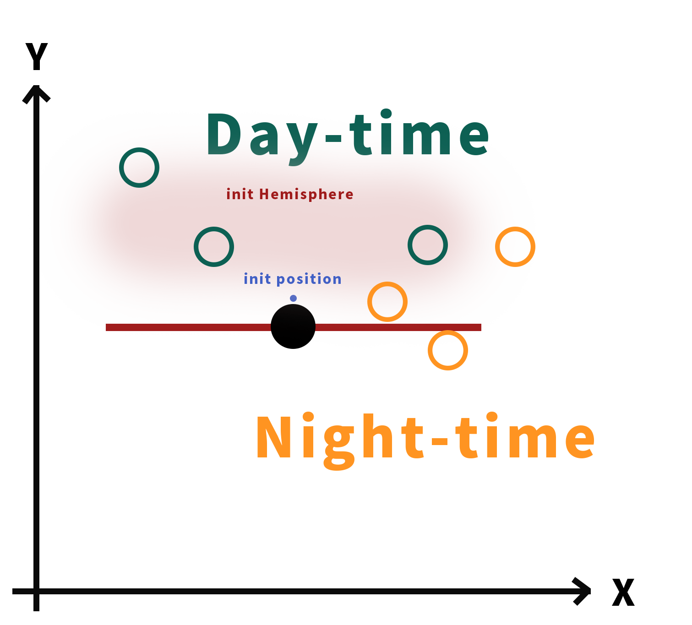

# SI100B Homework 2: Origin of Trisolarans

* **Authors**: Zhang Qixuan \<zhangqx1@shanghaitech.edu.cn\>,  Zhang longwen \<zhanglw2@shanghaitech.edu.cn\>, Ye Zhe \<yezhe@shanghaitech.edu.cn\>.
* **Supervised, proofread, edited and approved** by Prof. Yue Qiu \<qiuyue@shanghaitech.edu.cn\>.
* **Proofread and calibrated** by Ziqi Gao \<gaozq@shanghaitech.edu.cn\> and Qifan Zhang \<zhangqf@shanghaitech.edu.cn\>.
* **Release Time**: Mar. 30, 2020
* **Deadline**: 23:59:00 Apr. 16, 2020 China Standard Time (UTC+8:00)
* **Last Modified**:  Mar. 23, 2020

## Introduction

Your classmate Gezi Wang told you that he just fell in love with a girl, and he needs your help to win the heart of his dream lover.

Considering that the girl is a big fan of Cixin Liu’s science fiction, especially The Three-Body Problem, you decided to write a program to simulate the origin of Trisolarans (三体星人).

Let’s get started.

## Getting Started

Please simply fork the [repository](http://gitlab1.q71998.cn/homework-20s/homework-2) on GitLab and follow the structure and submissions' guidelines below and on Piazza.

Remember to **make your repository private** before any commits.

*Note*: Markdown text with file extension ***.md*** could be displayed properly using plug-ins in your browsers, IDEs or specialized markdown editors (like [typora](https://typora.io/)).

## Repository Structure

### README.md

Homework description and requirements.

### trisolar.py

A basic template for this homework. It also includes some simple **testing codes**. You need to fill-in your answer code for task 1, task 2, task 3 and bonus task in `trisolar.py` and submit it. 

## Submission

**You should check in trisolar.py to GitLab.**

First, make a commit and push your files. From the root folder of this repo, run

```shell
git add trisolar.py
git commit -m '{your commit message}'
git push
```

Then add a tag to create a submission.

```shell
git tag {tagname} && git push origin {tagname}
```

You need to define your own submission tag by changing `{tagname}`, e.g.

```shell
git tag first_trial && git push origin first_trial
```

**Please use a new tag for every new submission.**

Every submission will create a new GitLab issue, where you can track the progress.

## Regulations

- You may **not** use third-party libraries.
- No late submissions will be accepted.
- You have 30 chances of grading (i.e. `git tag`) in this homework. If you hand in more than 30 times, each extra submission will lead to 10% deduction. In addition, you are able to require grading at most 10 times every 24 hours.
- We enforce academic integrity strictly. If you participate in any form of cheating, you will fail this course immediately. **DO NOT** try to hack GitLab in any way. You can view the full version of the code of conduct on the course homepage: https://si100b.org/resource-policy/#policies.
- If you have any questions about this homework, please ask on Piazza first so that everyone else could benefit from the questions and the answers.

## Specification

### Task 1: 2D N-Body Problem simulation

In order to simulate the origin of trisolarans, we need to build a celestial movement model first, which is an N-Body Problem. The method we chose is Numerical Simulation.

Let’s consider the simplest case. 

Imagine that there is a **2D** micro universe, and now you have $N$ planets and their basic physical information (i.e., `mass`, `coordinate`, `speed` ) was given. Radius of those planets are really small compared to their distance, which means they can be regarded as mass points. Time in this universe is not continuous, so at each unit of time the planets will move a little bit according to their relative location in previous unit of time and the speed will be updated, which is same as the basic idea of Numerical Simulation. 

Movement of planets follows Newton's law of universal gravitation $\vec F=-G\frac{m_{1}m_{2}}{r^{2    }}\vec e$, where $G=1$, $\vec e$ is the unit vector of the connection between two planets. 

**Hint**

* To predict the planet's position, you need to calculate the force between every planet and get each planet's force situation(受力情况).
* The smallest unit of time used in simulation is 1, which is unable to be split anymore(so called 1 time unit).
* Use orthogonal decomposition to deal with vectors.
* All the given physical information has been converted to standard unit.
* Update the speed first and then the location according to the updated speed. i.e.
  * for all planets, update their speed by
  * v_new=v_old+F/m
  * for all planets, update their position by
  * position+=v_new

You could refer to Appendix A for a specification of input and output of your program. Your solution should be in `trisolar.py`. Tests for this task will account for 60% of your overall score of this homework.

### Task 2: Chaotic Era & Stable Era

Now there are three suns and one planet in a stellar system. If the sun and planet are too close(**less than or equal to 200 distance unites**), the planet will be **affected** by the sun.

Climate in Trisolaris (三体星) can be classified as Chaotic Era and Stable Era. The Chaotic Era has such phenomena:

* **Double-Solar Day**: the planet is only affected by 2 of the suns.

* **Tri-Solar Day**: the planet is affected by 3 of the suns.

* **Eternal Night**: the planet is not affected by any of the suns.

At a specific time unit, if the planet satisfies one of those three phenomena, we will call it **Chaotic Era**, otherwise it is in **Stable Era**. 

**Hint**

* The planet will also affect the three suns, which means when considering the force situation of the sun, you shouldn't ignore the gravity caused by the planet.

You could refer to Appendix A for a specification of input and output of your program. Your solution should be in `trisolar.py`. Tests for this task will account for 30% of your overall score of this homework.

### Task 3: Origin of Trisolarans

Finally, we can simulate the Origin of Trisolarans.

Intelligent life can be divided into different levels according to their technological development. We simply assume that the longer they live, the higher technological development they can achieve. However, in Chaotic Era Trisolarans need to be **dehydrated (脱水, 小说里的一种设定; 脱水会造成文明倒退)** which means their civilization would go backwards. So in each unit time of Stable Era, Trisolarans **get 2 civilization scores**, while in each unit time of Chaotic Era they **lose 1 civilization score**. Once the civilization score comes to negative, civilization vanishes, and will not be reborn.

So at the given check time, for the civilization score $S$,

* Once $S < 0$: No civilization 
* If $0 \leq S < 400$: level 1 civilization 
* If $ 400 \leq S < 1200$: level 2 civilization 
* If $ 1200 \leq S$: level 3 civilization 

**Hint**

* The planet will also affect the three suns, which means when considering the force situation of the sun, you shouldn't ignore the gravity caused by the planet.

You could refer to Appendix A for a specification of input and output of your program. Your solution should be in `trisolar.py`. Tests for this task will account for 10% of your overall score of this homework.

### Bonus Task: Day & Night in Trisolaris

Now we know that the self-rotation speed of Trisolaris is 1/time-unit(clockwise), which means it needs 360 time units for one rotation. Assume that a Trisoloran is standing at the initial position shown in the graph below, where the tangent of the planet that passes through his/her current standing point is parallel to x-axis and vertical to y-axis. The hemisphere that he/she belongs to is determined by his/her standing point, which is the center of the hemisphere. In this case, his/her hemisphere is the hemisphere that is above the red line. In each time unit, if all the three suns are at the same side of his hemisphere(include edges), i.e. the side of the red line that the guy is standing at, we say it is a day-time, otherwise it is a night-time.



So how many day-times this Trisolaran can spend before the given check time?

**Hint**

* Spending the day-time means that it is a day-time and not in Chaotic Era.

You could refer to Appendix A for a specification of input and output of your program. Your solution should be in `trisolar.py`. Tests for this task will account for 20% extra score of your overall score of this homework.

## Testing and Grading

`trisolar.py` has included some simple testing codes. You could fill-in your answer code for task 1, task 2, task 3 and bonus task in `trisolar.py` to test. 

### Hint

* You don't need to worry about edge cases(such as should we count start from t=0 or t=1) since the OJ will accept 5% error for task1 and bonus task. For task2 and task3 we will ensure that the cases are at least 5% distances away from the edge condition.
* Testcases will ensure that the planets won't collide.
* We will avoid cases which are so micro that may cause the loss of precision.
* If you think you just solve this problem in a precise way for continuous cases, please contact us ASAP since you may win a Fields Award by this. 

Good luck!

## Appendix A. Input and Output

### A.1 task 1

For task 1, we will test your program by giving a list of planets and their initial(at 0 time unit) physical information (i.e. `mass`, `coordinate`, `speed`, all the given physical information has been converted to standard unit) to your program through the function call. Your program shall return the planets' location at the given `check_time`.

You can test your program in a manner like the following code snippet.

```python
task1(
    2,
    1986,
    [
        [10000, 0, 0, 0, 0],
        [0.1, 1000, 0, 0, sqrt(10)]
    ]
)
```

The input format will be given in the format as below.

```python
task1(
    planets_num,
    check_time,
    [
        [planet1_mass, planet1_coordinate_x, planet1_coordinate_y,
         planet1_speed_x, planet1_speed_y],
        [planet2_mass, planet2_coordinate_x, planet2_coordinate_y,
         planet2_speed_x, planet2_speed_y],
        ...
        [planetn_mass, planetn_coordinate_x, planetn_coordinate_y,
         planetn_speed_x, planetn_speed_y],
    ]
)

```

The return format will be given in the format as below.

```python
[
    [planet1_coordinate_x, planet1_coordinate_y],
    ...
    [planetn_coordinate_x, planetn_coordinate_y]
]
```

Where

* `planets_num`: the number of given planets (positive integer)
* `check_time`: the time unit you need to output the location (positive integer)
* `planetn_coordinate_x`: planet-n's location in x-axis (float)
* `planetn_coordinate_y`: planet-n's location in y-axis (float)
* `planetn_speed_x`: planet-n's speed in x-axis (float)
* `planetn_speed_y`: planet-n's speed in y-axis (float)

### A.2 task 2

For task 2, we will test your program by giving a list of the three suns, planets and their initial (at 0 time unit) physical information (i.e., `mass`, `coordinate`, `speed`, all the given physical information has been converted to standard unit) to your program through function call. Your program shall return which situation (i.e.,`Double-Solar Day`, `Tri-Solar Day`, `Eternal Night`, `Stable Era`) the planet is facing at the given `check_time`.

You can test your program in a manner like the following code snippet.

```python
task2(
    1986,
    [
        [1000, 0, 0, 0, 0],
        [1, 1000000, 0, 0, 0],
        [1, -1000000, 0, 0, 0],
        [0.1, 100, 0, 0, sqrt(10)]
    ]
)
```

The input format will be given in the format as below.

```python
task2(
    check_time,
    [
        [sun1_mass, sun1_coordinate_x, sun1_coordinate_y,
         sun1_speed_x, sun1_speed_y],
        [sun2_mass, sun2_coordinate_x, sun2_coordinate_y,
         sun2_speed_x, sun2_speed_y],
        [sunn_mass, sunn_coordinate_x, sunn_coordinate_y,
         sunn_speed_x, sunn_speed_y],
        [planet_mass, planet_coordinate_x, planet_coordinate_y,
         planet_speed_x, planet_speed_y],
    ]
)

```

The return format will be given in the format as below

```
<situation>
```

Where

* `check_time`: the time unit you need to output the location (positive integer)
* `sunn_coordinate_x`: planet-n's location in x-axis (float)
* `sunn_coordinate_y`: planet-n's location in y-axis (float)
* `sunn_speed_x`: planet-n's speed in x-axis (float)
* `sunn_speed_y`: planet-n's speed in y-axis (float)

* `planet_coordinate_x`: planet's location in x-axis (float)
* `planet_coordinate_y`: planet's location in y-axis (float)
* `planet_speed_x`: planet's speed in x-axis (float)
* `planet_speed_y`: planet's speed in y-axis (float)
* `<situation>`: situation of the planet, including Double-Solar Day, Tri-Solar Day, Eternal Night, Stable Era (string)

### A.3 task 3 & Bonus task

For task 3 & Bonus task, we will test your program by giving a list of three suns, planets and their initial (at 0 time unit) physical information (i.e., `mass`, `coordinate`, `speed`, all the given physical information has been converted to standard unit) to your program through the function call. For task 3, your program shall output the civilization (i.e.,`No civilization `, `level 1 civilization`, `level 2 civilization`, `level 3 civilization`) the planet at the check time. For Bonus task, your program shall output the number of days that the Trisolaran could spend at the check time.

You can test your program in a manner like the following code snippet.

The input format will be given in the format as below.

```
task3(
    check_time,
    [
        [sun1_mass, sun1_coordinate_x, sun1_coordinate_y,
         sun1_speed_x, sun1_speed_y],
        [sun2_mass, sun2_coordinate_x, sun2_coordinate_y,
         sun2_speed_x, sun2_speed_y],
        [sunn_mass, sunn_coordinate_x, sunn_coordinate_y,
         sunn_speed_x, sunn_speed_y],
        [planet_mass, planet_coordinate_x, planet_coordinate_y,
         planet_speed_x, planet_speed_y],
    ]
)

task_bonus(
    check_time,
    [
        [sun1_mass, sun1_coordinate_x, sun1_coordinate_y,
         sun1_speed_x, sun1_speed_y],
        [sun2_mass, sun2_coordinate_x, sun2_coordinate_y,
         sun2_speed_x, sun2_speed_y],
        [sunn_mass, sunn_coordinate_x, sunn_coordinate_y,
         sunn_speed_x, sunn_speed_y],
        [planet_mass, planet_coordinate_x, planet_coordinate_y,
         planet_speed_x, planet_speed_y],
    ]
)
```

The return format for task 3 will be given in the format as below.

```
<civilization_level>
```

The return format for bonus task will be given in the format as below.

```
<number-of-day-that-could-spend>
```

Where

* `check-time>`: the time unit you need to output the situation (positive integer)

* `sunn_coordinate_x`: sun-n's location in x-axis (float)
* `sunn_coordinate_y`: sun-n's location in y-axis (float)
* `sunn_speed_x`: sun-n's speed in x-axis (float)
* `sunn_speed_y`: sun-n's speed in y-axis (float)
* `planet_coordinate_x`: planet's location in x-axis (float)
* `planet_coordinate_y`: planet's location in y-axis (float)
* `planet_speed_x`: planet's speed in x-axis (float)
* `planet_speed_y`: planet's speed in y-axis (float)
* `<civilization-level>`: civilization level of the planet, including No civilization, level 1 civilization, level 2 civilization, level 3 civilization (string)
* `<number-of-day-that-could-spend>`: integer
