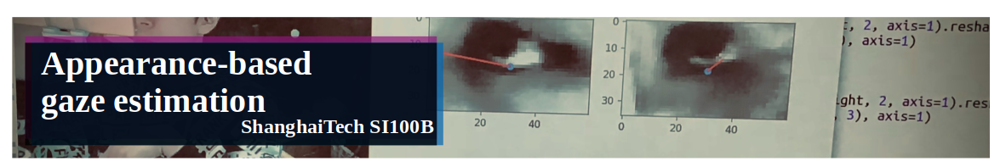
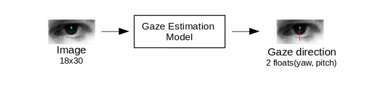
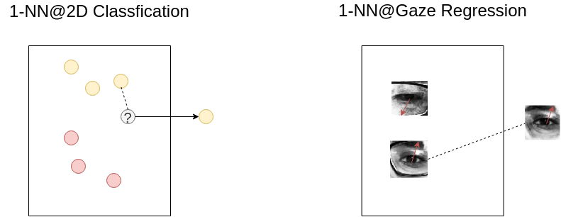
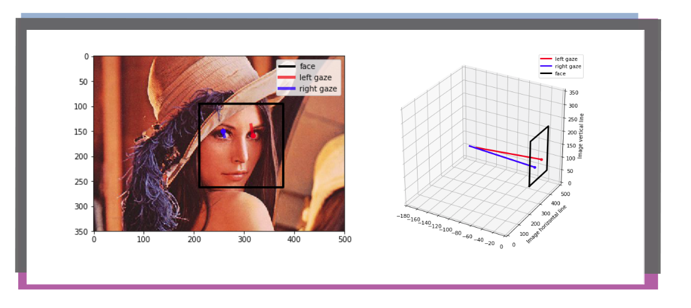
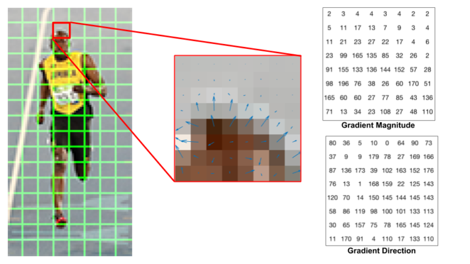
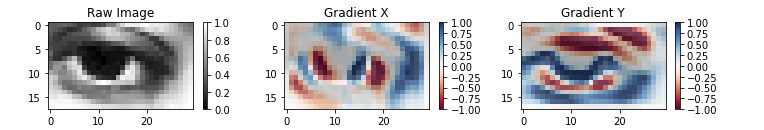

# Homework 6 - Appearance-based Gaze Estimation

- **Authors:** Yintao Xu [xuyt@shanghaitech.edu.cn](xuyt@shanghaitech.edu.cn)
- **Supervised, proofread, edited and approved** by Prof. Haipeng Zhang [zhanghp@shanghaitech.edu.cn](mailto:zhanghp@shanghaitech.edu.cn).
- **Deadline:** 23:59:00 Jun 18 (Thu.), 2020, China Standard Time (UTC+8:00)
- **Proofread and calibrated** by Ziqi Gao [gaozq@shanghaitech.edu.cn](mailto:gaozq@shanghaitech.edu.cn).
- **Last modified:** 2020-05-26

This is a PBL(project-based learning) assignment for numpy and pandas. During constructing a model of gaze estimation, you would get to know knowledge about numpy and pandas.

## Introduction

Gaze tracking or gaze estimation is an important topic for understanding human visual attention. Such  a technology has been widely deployed in various fields, such as human–computer interaction, visual behavior analysis, and psychological studies. Based on its huge potential value, many eye tracking devices (e.g., Tobii X3-120, Tobii EyeX, and Eye Tribe) have come into being. However, most of these devices are very expensive to purchase, making them hampered in wide adoption. Usually, **appearance-based gaze estimation employs a top-down strategy, which predicts the gaze direction or gaze point through eye images directly**. Such an approach is well established as another alternative for eye tracking since only achieving eye images is much cheaper. [1]


Many datasets are built to study this topic, including
- [ShanghaiTechGaze+](https://ieeexplore.ieee.org/document/8454246/authors#authors): a multi-view dataset with depth information
- [MPIIGaze](https://www.mpi-inf.mpg.de/departments/computer-vision-and-machine-learning/research/gaze-based-human-computer-interaction/appearance-based-gaze-estimation-in-the-wild/): a dataset for estimating gaze direction
- [GazeCapture](https://gazecapture.csail.mit.edu/): provides a large-scale(~1474 subjects) on apple devices for estimating end-to-end postion on device.

## Repository Structure

```
.
├── AppearanceGazeEst.py
├── dataset
│   └── README.md
├── figures
│   └── ...
├── gazelib
│   ├── ...
│   └── utils
│       ├── ...
├── README.md
├── Task 1 - Introduction & simple statistics - pandas.ipynb
├── Task 2 - Do Estimation With KNN - numpy.ipynb
└── Task 3 - Histogram Of Gradient - numpy.ipynb
```

- `AppearanceGazeEst.py`: Your codes will be written here.
- `dataset`: One Jupyter notebook will guide you to download data here
- `figure`: all figures involved in this assignment
- `gazelib`: all helper codes are saved here
- `README.md`: what you are reading at
- `Task 1, 2, 3 xxx.ipynb`: Those three Jupyter notebooks include step-by-step guidance to this assignment and provide local test for each function, following guides in notebook to write your code

## Prerequisites

1. Anaconda 3
2. requests ~= 2.19.1 

## QuickStart

This project relies on `pandas`, `numpy`, `Jupyter notebook`, `opencv`, `matplotlib`, etc. Solving the dependency is awkward. However, [anaconda](https://www.anaconda.com/) provides an elegant one-stage solution.

**First step**: Install [anaconda](https://www.anaconda.com/).

**Second step**:  Install **requests**(for automatizing the download of dataset). Or you could follow instructions at  `dataset\Readme.md` to download manually, skipping cells in notebook of downloading.

```bash
# Open a console to install requests by pip
# If you install python2 & 3 at the same time, try 'pip3' instead of 'pip'.
# You may check that you have properly set  the environment.
pip install requests
```

**Third step**: Open Jupyter notebook.

Start a console at root of repository, and type in commands below:

```bash
jupyter notebook

# You may see following output
...
[I 21:42:23.922 NotebookApp] The Jupyter Notebook is running at:
[I 21:42:23.922 NotebookApp] http://(liubai01-Z170X-UD3 or 127.0.0.1):8888/

```

Normally, after booting of [Jupyter notebook](https://jupyter.org/), you will see a web page in browser below. Click `Task 1 - Introduction & simple statistics - pandas.ipynb` to start your journey at this homework! Jupyter notebook will provide you with an excellent interactive programming experience.

## Tasks introduction

There are three tasks in total. Generally, you should follow guidelines at notebook and complete codes at  `AppearanceGazeEst.py`. You should pass the local test, which could largely guarantee your final score at on-line judge.

### Task 01 : Introduction & simple statistics - pandas (30%, ~19 lines of code)

In task one, you will be faced with **six questions of pandas** over gaze estimation dataset [MPIIGaze](https://www.mpi-inf.mpg.de/departments/computer-vision-and-machine-learning/research/gaze-based-human-computer-interaction/appearance-based-gaze-estimation-in-the-wild/). Relax. Each question will take you less than 2 minutes.

- Guidelines are in `Task 1 - Introduction & simple statistics - pandas.ipynb`
- Notebook will guide you to download the dataset.
  - **mean_of_tgt_subject** (5%)
  - **count_tgt_subject** (5%)
  - **get_min_val_of_tgt_col** (5%)
  - **sort_ids_by_stdofcol** (5%)
  - **compute_mean_eye** (5%)
  - **add_glasses_info** (5%)

### Task 02 :  Do Estimation With KNN - numpy (35%, ~20 lines of code)

In task02, you would start from a naive "Eye Search Engine" to do `image2image` search. Then, convert it to a KNN model to estimate gaze direction.

In machine learning context, there are two chief types of problems in this area:

- **classification**: is about predicting a label(e.g: is it rainy tomorrow?).
- **regression** is about predicting a quantity(e.g: the gaze vector according to the image). 



You are going to implement two simple models to figure it out by querying images at dataset:

For **1-NN** model:

- Compute the Euclidean distance from the query example to the labeled examples.
- Find the image with the most similarity.
- Take its corresponding label as output.



For **k-NN** model:

- Compute the Euclidean distance from the query example to the labeled examples.
- Find the k images with the most simlarity.
- Take the median of their corresponding labels as output.


- Guidelines are in `Task 2 - Do Estimation With KNN - numpy.ipynb`

  - **KNN_idxs** (10%)
  - **oneNN** (5%)
  - **KNN** (5%)
  - **KNN_weighted** (15%)

  A **demo**(0%): You can have your own image to estimate the gaze direction at the end of this section.



## Task 03 - Histogram Of Gradient - numpy (35%, ~35 lines of code)

There is a widely accepted assumption in computer vision community: 
> local object appearance and shape can often be characterized rather well by **the distribution of local intensity gradients or edge directions**, even without precise knowledge of the corresponding gradient or edge posistions.



Therefore, studying the **image gradient** is important. It is a directional change in the intensity or color in an image. 



Guidelines are in `Task 03 - Histogram Of Gradient - numpy.ipynb`

- **conv2d** (15%)
- **compute_grad** (15%)
- **bilinear_HOG** (Bonus, 10%)
- **KNN_HOG** (5%)

## Submit

You should check in `AppearanceGazeEst.py`  to GitLab.

First, make a commit and push your own `AppearanceGazeEst.py`. From the root of this repo, run:

```
git add AppearanceGazeEst.py
git commit -m"{Your commit message}"
git push origin master
```

Then add a tag to request grading on your current submission:

```
git tag {tagname} && git push origin {tagname}
```

Beware that all of your tag names should be distinguished among one homework repo. Therefore, remember to use **a new tag name** `{tagname}` in each submission.

Every submission will create a new GitLab issue, where you can track the progress.

##  Regulations

- No late submission will be accepted
- You will have 30 chanced of grading. You are able to require at most 10 times every 24 hours. If you hand in more than 30 times, each extra submission will lead to 10% deduction.
-  **Hard code is strictly forbidden.** Once found, your score of this homework will be set as 0.
- We enforce academic integrity strictly. If you participate in any from of cheating, you will fail this course immediately. You can view full edition on [Piazza](https://piazza.com/class/jrykv8wi15m5dx?cid=7).
- If you have any question about this homework, please ask on Piazza first.

## Reference

```
Task 1:
[1] @ARTICLE{
    8454246, 
    author={D. {Lian} and L. {Hu} and W. {Luo} and Y. {Xu} and L. {Duan} and J. {Yu} and S. {Gao}}, 
    journal={IEEE Transactions on Neural Networks and Learning Systems}, 
    title={Multiview Multitask Gaze Estimation With Deep Convolutional Neural Networks}, 
    year={2019}, 
    volume={30}, 
    number={10}, 
    pages={3010-3023}, 
    keywords={computer vision;convolutional neural nets;estimation theory;gaze tracking;multiview cameras;multiview gaze tracking data;convolutional neural networks architecture;multiview multitask gaze point estimation solution;multiview eye images;gaze direction estimation;deep convolutional neural networks;Estimation;Gaze tracking;Head;Task analysis;Feature extraction;Cameras;Robustness;Convolutional neural networks (CNNs);gaze tracking;multitask learning (MTL);multiview learning}, 
    doi={10.1109/TNNLS.2018.2865525}, 
    ISSN={2162-2388}, 
    month={Oct},
}
[2] @inproceedings{zhang15_cvpr,
    Author = {Xucong Zhang and Yusuke Sugano and Mario Fritz and Bulling, Andreas},
    Title = {Appearance-based Gaze Estimation in the Wild},
    Booktitle = {Proc. of the IEEE Conference on Computer Vision and Pattern Recognition (CVPR)},
    Year = {2015},
    Month = {June}
    Pages = {4511-4520}
    }
Task 2:
[1] Intuitively Understanding Convolutions for Deep Learning: https://towardsdatascience.com/intuitively-understanding-convolutions-for-deep-learning-1f6f42faee1
[2] Image gradient wiki: https://en.wikipedia.org/wiki/Image_gradient
[3] One of image gradient visualization is imported from: https://www.learnopencv.com/histogram-of-oriented-gradients/
[4] https://en.wikipedia.org/wiki/Sobel_operator
[5] https://www.learnopencv.com/histogram-of-oriented-gradients/
[6] https://en.wikipedia.org/wiki/Atan2
[7] https://www.geeksforgeeks.org/vectorization-in-python/
Task 3:
[1] Intuitively Understanding Convolutions for Deep Learning: https://towardsdatascience.com/intuitively-understanding-convolutions-for-deep-learning-1f6f42faee1
[2] Image gradient wiki: https://en.wikipedia.org/wiki/Image_gradient
[3] One of image gradient visualization is imported from: https://www.learnopencv.com/histogram-of-oriented-gradients/
[4] https://en.wikipedia.org/wiki/Sobel_operator
[5] https://www.learnopencv.com/histogram-of-oriented-gradients/
[6] https://en.wikipedia.org/wiki/Atan2
[7] https://www.geeksforgeeks.org/vectorization-in-python/
```

